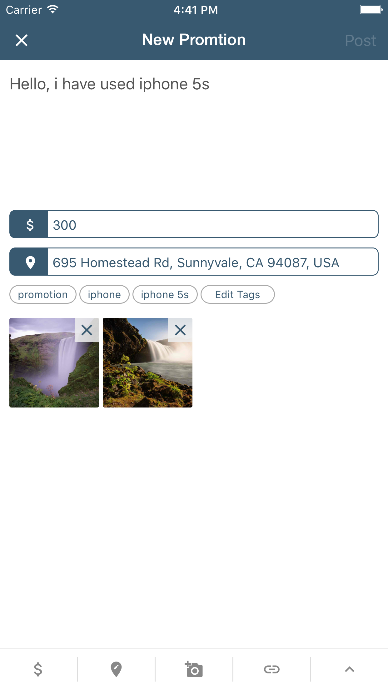
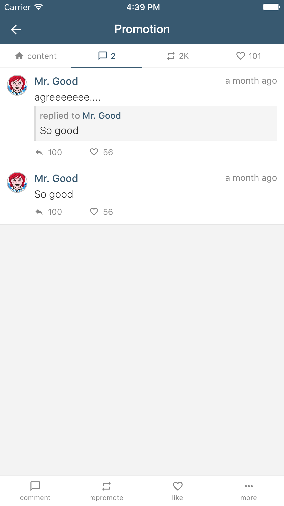

# SNS-Based Promotion - React Native

The is a App client for [**SNS-Based Promotion**](https://github.com/dingxizheng/sns-based-promotion), implemented using [**React Native**](http://facebook.github.io/react-native/). This is a demo project to show how to develop a complete app with React Native.

## How does it look like?

* The home page

* Create a post

* Promotion details

## How to run

1. Prepare your environment: [Requirements](http://facebook.github.io/react-native/docs/getting-started.html#requirements) and [IOS Setup](https://facebook.github.io/react-native/docs/getting-started.html#ios-setup)
2. Clone this repo, and goto the project root directory
3. run `npm install`
4. run `react-native start`

## Dependencies
* Flex Style
* Direct Manipulation
* Native UI Components
* DrawerLayoutAndroid
* Image/Text/ListView
* TouchableHighlight/TouchableNativeFeedback
* ToolbarAndroid/Navigator
* StyleSheet/ToastAndroid/BackAndroid
* Timers
* AsyncStorage
* Animations
* Customize view
* ...

## TODO

1. ~~Add local storage to cache data~~ (done)
2. ~~Add List header banner~~ (done)
3. ~~Add splash animation~~ (done)
4. ~~Add swipe/pull to refresh~~ (done)
5. ~~**iOS compatible**~~(done 80% of code in common)

## License

This project is available under the MIT license.