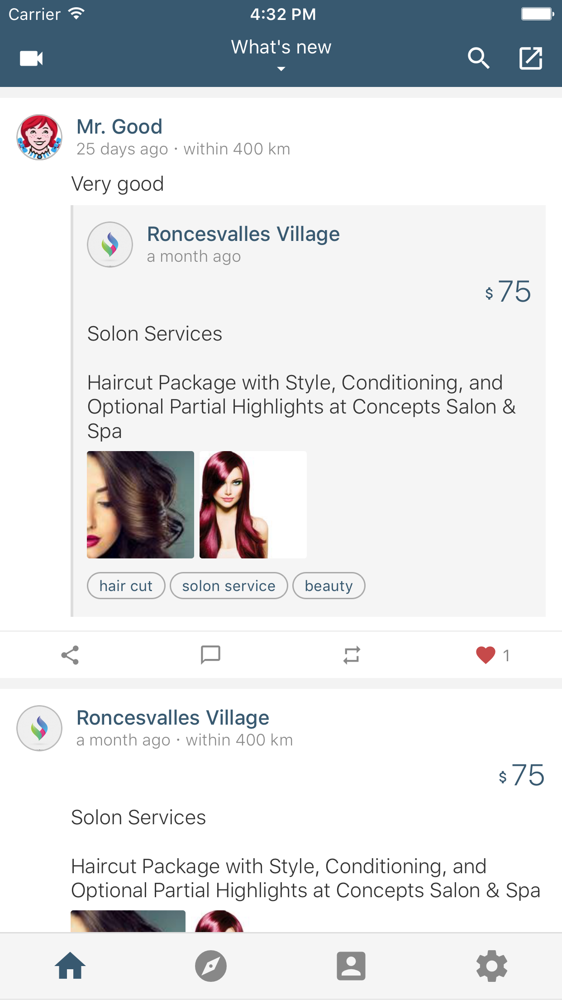

# SNS-Based Promotion - React Native

The is a App client for [**SNS-Based Promotion**](https://github.com/dingxizheng/sns-based-promotion), implemented using [**React Native**](http://facebook.github.io/react-native/). This is a demo project to show how to develop a complete app with React Native.

## How does it look like?

* The home page


<!--  -->

* Create a post


<!--  -->

* Promotion details


<!--  -->

## How to run

1. Prepare your environment: [Requirements](http://facebook.github.io/react-native/docs/getting-started.html#requirements) and [IOS Setup](https://facebook.github.io/react-native/docs/getting-started.html#ios-setup)
2. Clone this repo, and goto the project root directory
3. run `npm install`
4. run `react-native start`

## Dependencies
```
"backbone-events-standalone": "^0.2.7",
"geocoder": "^0.2.2",
"moment": "^2.11.2",
"query-string": "^3.0.0",
"react-native": "^0.17.0",
"react-native-background-geolocation": "^0.3.4",
"react-native-blur": "^0.7.9",
"react-native-fbsdkcore": "0.0.7",
"react-native-fbsdklogin": "0.0.7",
"react-native-file-transfer": "0.0.3",
"react-native-htmlview": "^0.2.0",
"react-native-image-picker": "^0.14.3",
"react-native-keyboard-spacer": "^0.1.3",
"react-native-lightbox": "^0.5.0",
"react-native-maps": "^0.3.0",
"react-native-navbar": "^1.2.1",
"react-native-overlay": "^0.4.1",
"react-native-parallax-scroll-view": "^0.17.4",
"react-native-refresh-control": "^2.1.0",
"react-native-router-flux": "^2.2.6",
"react-native-screcorder": "^0.1.1",
"react-native-scrollable-tab-view": "^0.3.5",
"react-native-spinkit": "0.0.7",
"react-native-storage": "0.0.12",
"react-native-swiper": "^1.4.3",
"react-native-tableview": "^1.4.7",
"react-native-tableview-simple": "^0.6.0",
"react-native-triangle": "0.0.5",
"react-native-vector-icons": "^1.1.0",
"react-native-video": "^0.6.1",
"react-refresh-control": "^2.0.5",
"react-timer-mixin": "^0.13.3",
"tcomb-form-native": "^0.3.3",
"validator": "^4.9.0"
```
## License

This project is available under the MIT license.